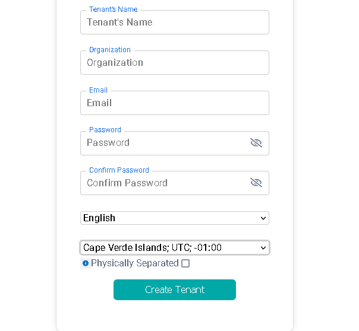

## Tenant

 

Tenant represents an Organization hosted on the Devgo ecosystem, specifically an organization in the EZ2Cloud platform.
The Tenant is the container for items of your Organization such as products, domains, subscriptions.
When you create a Tenant for your organization, you must use a valid and official email address that can be latter be checked.

It is mandatory to create a Tenant, or in other words register your organization into our platform in order to start using EZ2Cloud software

After a validation process to checks for the of the Tenant email of your company, initial configuration will be triggered. Associated with the tenant the company can have  Admin account, and create their users, projects and start working. 

## Tenant in EZ2Cloud

 

To create a new Tenant in the EZ2Cloud you must fill with valid data pieces the form on the image above. We want to highlight:

1. Tenant Name - It is the name for your Tenant and it can be any valid word in english or another language. Also the name can include numbers. It is forbiden the use of others characters.

2. Organization  - Official name of your company or a brand name.
     
3. Language - It is the default language that all the text will be displyed by default. For all the tenant users this will be the language until the use change it for one language of his choice. Also email notifications will be sent on the language defined here. This can be changed on the Settings by a admin user.

4. Time Zone - Time zone to be used as default for all the process that need to used time information.

After creating a new Tenant an email will be sent to the email address to trigger the validation process. After a successful validation the user can sign in for the first with the email and the password previously entered. 

