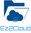

 

## Essentials Documentation
Welcome to EZ2Cloud. We're glad to have you here. As a EZ2Cloud end-user you have access to all the features
your subscription includes, except EZ2Cloud administrator features. Of course these features are restricted for a user as member of an admin account.

For specific information on configuring EZ2Cloud see the Administrator documentation.

## Overview

 

The functionalities and features you will find on these pages are related with the main goal of EZ2Cloud: provides a colaborative and distribuited platform that allows you define and apply all the elements required on a migration job from on server to another or from an on-premise server to a cloud service.
 

To achieve this goal, EZ2Cloud relies in gathering data and produce information related with metada from files and folders located on a server network shared folder. Specifically the data that will be gatther from the users that actually works with the file servers contents in a distrubted and colaborative approach.

The metadata gather from server will be mapped to entities representing files and folders on EZ2Cloud, allowing each user to apply to files amd folders some labels. To sum up the platform will presents the users some file and let them assign labels, owners and with all the data gather and processed later on an authorized user can create and export a file with items that will be the source data for the migration.

In order to provide insight in with the concepts needed to properly use Ez2 Cloud, read the following articles [Entities and Concepts Details](./Concepts/index.md) 

Also in our documetantion you can find out [Use cases](./UserCases/index.md) how you can use EZ2Cloud features to implement better solutions on migratation file servers contents.

Following, you can direct access to links and learn how to use features to quickly get your work done. These links are all related with features that are commonly used by users in general. To have specifics details on how to use features for user belonging to roles Project Administrator and Label Administrator please refer to 
## [Common Features to all roles ](./CommonFeatures/index.md) 
1. [Getting Start](./CommonFeatures/index.md)
     * [New User](./CommonFeatures/newuser.md)
     * [First time log in](./CommonFeatures/firsttimelogin.md)
2. [Work with Projects](./projects/colab.md)
     * [Semantic Labeling](./projects/assignlabel.md)
     * [Ownership Labeling](./projects/assignowner.md)
3. [Account Settings](./CommonFeatures/accountsettings.md)

## [Features to specifics roles](./Rolebased/index.md) 

1. [Role Project Administrator](./Rolebased/projectadmin.md)     
2. [Role Label Administrator](./Rolebased/labeladmin.md)     

