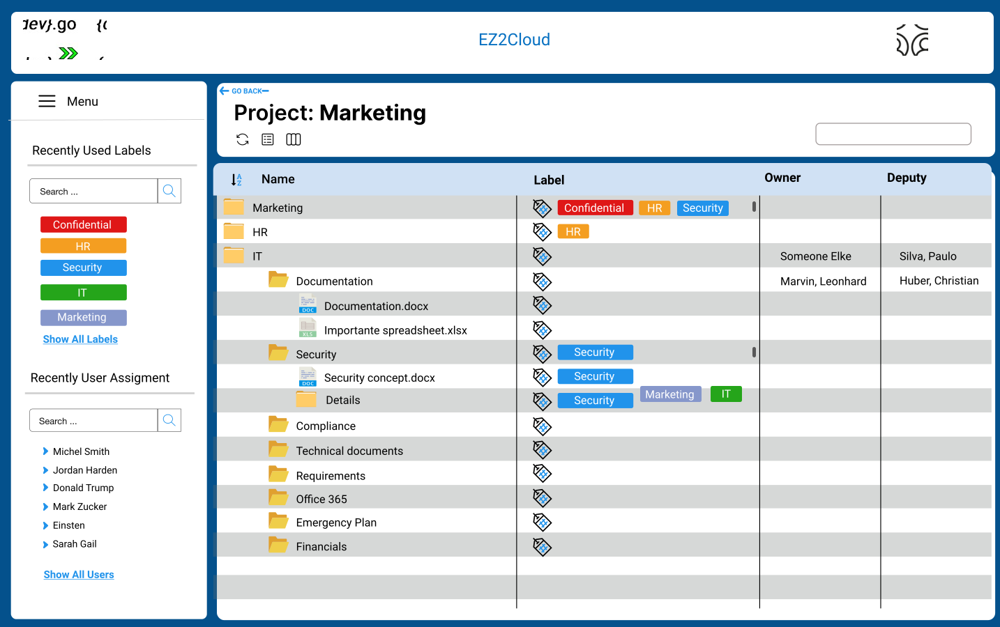

## Colaborative Work in Projects

The work each user can perform on a project consist in assign semantic label and ownership label to files and folder of the directory structure as they are represented by the project unit in EZ2Cloud.

The users that have access to a project can label all files and folders the project contains.  
The process of doing this work may involve not just one but multiple users. They all can perform the assign semantic or ownership label task. By his natures this is a distributed process and also we must consider the collaborative aspects of the tasks. So in EZ2Cloud we implement a collaborative and distributed working area that might involve different users. 

The collaborative working area is the File Explorer and the main sections are showed in the following image.

The collaborative work is supported by providing means that allow each user to perform semantic labelling and ownership lalelling. 

1. Semantic Labelling - User can drag and drop a semantic label from the list of label at the left side of the File Explorer window to the column named Label. As this is a semantic label each users can assing choose and assign a label that is more accurate to classify the file or folder.
2. Ownership Labelling - user can perform ownership labelling by drag and drop a user label from the list of users at the left side of the File Explorer window to the column named Owner or Deputy Owner. This will results in set the Owner or deputy owner of an item. Each item (file or folder) can have at most one user as its owner and one user as deputy owner.

