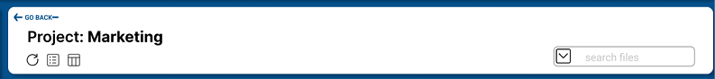
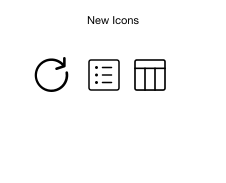
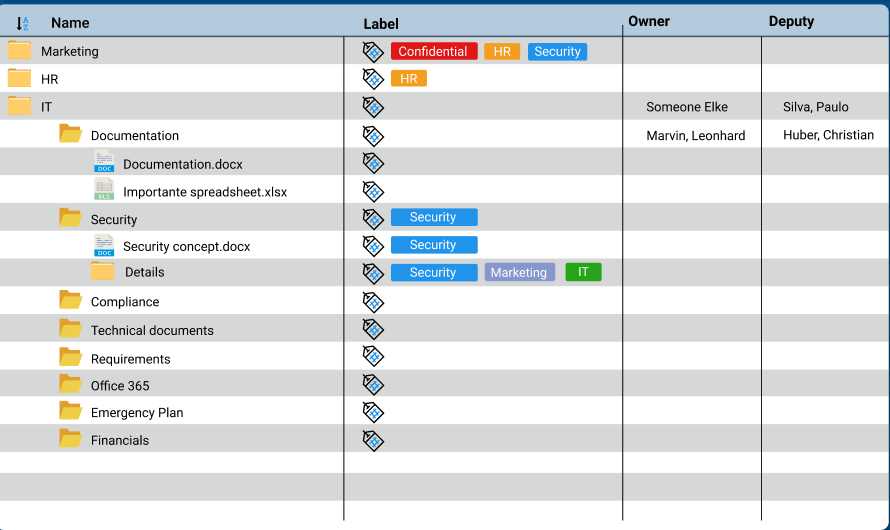
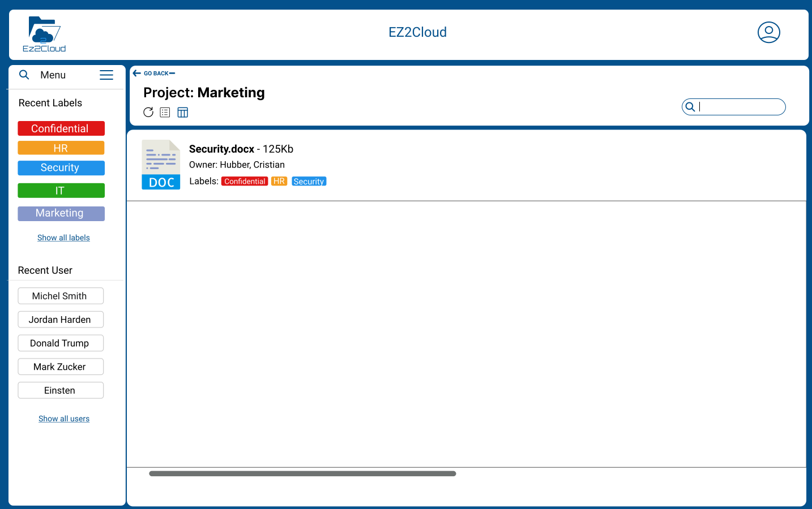
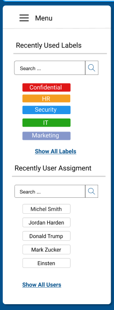
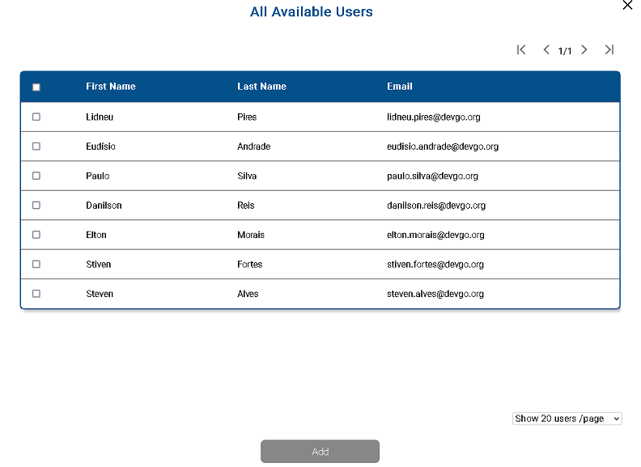

## File Explorer

File Explorer, it is the name of the main window to work in a project. It will be displayed after a user click on the button Open of the Project Unit Information on the End-user main window. 

The default view on a Desktop device it is as showed on the following image

## [File Explorer in Details](./fileexplorer.md#) 

Next it will be highlighted the following components or areas of the File Explorer: 

1. Project Information Control - This area it is at the top and contain the project Name, buttons to controls how to is displayed the Project hierarchy.
2. Project Hierarchy - Representation in EZ2Cloud of the directory hierarchy as it is on the network shared folder that the project it is bounded.
3. Tag Elements - List of Semantic and Ownership labels that can be use to labelling files and folders.

## [Project Information Control](./fileexplorer.md#)  

 Here the user will view the title of name of the Project. Above the projet name the user can go back to the list of projects by clicking on the Go Back link. 

At the right side there's a search bar where the user can search all the project item by entering keywords, file type, users. For more information on Search see How to Search Projects Items. 
Beneath the project name there are buttons, ss shown in the following image, that will change the view of File Explorer from Column to List. 

## [Project Hierarchy](./fileexplorer.md#) 

As shown in image above File Structure it is a the representantion of the Files and Folders bounded to a network share folder content. So the Project Structure in Ez2Clould would mirror the view that a user have would have on network share folder but with enhanced elements and of course with the labels assigned to each item.

There is another Project Hierarchy view. To access it the user must click on the button Column View of the project control area and the 
Project Hierarchy will be displayed as the follwing image:

## [Tags Lists](./fileexplorer.md#) 

Tags Lists are lists with all the semantic and ownership labels that a user can work with in a project. They are configured by the administrator and will be dinamically loaded on the list and presented as the follwing images.

The semantic and ownership labels can be chosen from the list on the left of the project structre. Both users and labels are order by the most recents used from the leasts ones. 

If you want to use needs a semantic or ownership label not present in the list, either click:

1. Show All Labels
2. Show All Users
   
to choose a label not list on the menu. 

## [Choosing not listed Tags](./fileexplorer.md#) 

 To use a semantic label not present in the list, after click on Show All Labels you will view this modal window 

Just click and select the labels you want, then click button Add and the selected tags will be added to the Tags List Elements. 

 To use an ownership label not present in the list, after click on Show All Users you will view this modal window as following

Just click and select the users you want, then click button Add and the selected Users will be added to the Tags List Elements. 

   