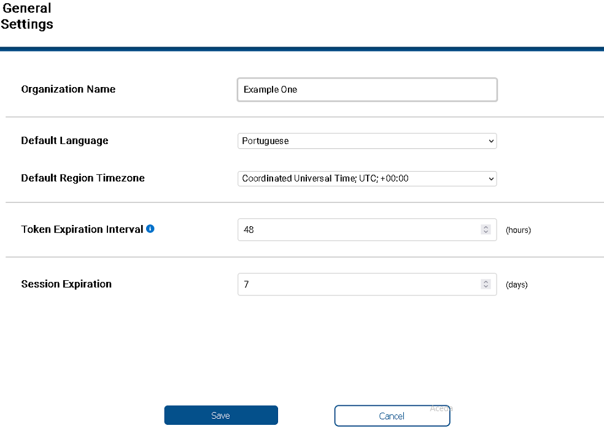

 

## General Settings

 

These are settings that refers to that affect the application operation for all Tenant users. Most of these settings their names are self-explanatory. However, it is presenting a concise definition of its meaning.

. To change one of the settings change the corresponding field and click the button Save.

1. **Organization Name** - Name of the Tenant organization. This was first set when the Tenant was created. It is not the same as the Tenant name. 
2. **Default Language** - All the notification email sent it is based on the Tenant default language. So this is the Tenant official language. However each user can define the language to use in Ez2cloud.
3. **Default Region Timezone** - The timezone that will be reference for all process using date and time values.
4. **Token Expiration Interval** - Every operation that needs to keep track of a specfic user in the context of EZ2Cloud has a token. This is valid for a specifc time period.  This setting will define the period in terms of hours.
5. **Session Expiration** - Define the time period a user session will be active. This is defined in days.

  
