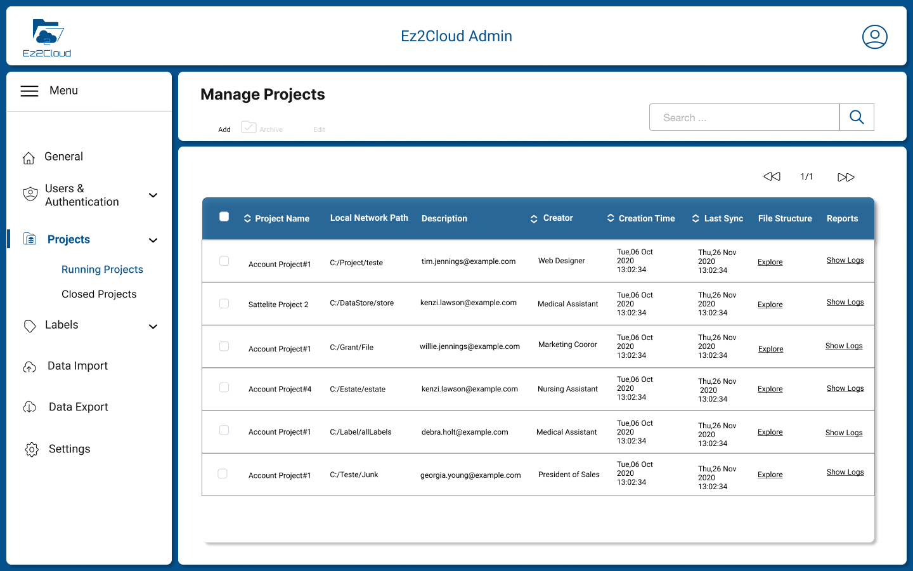

 

## Admin Guide: Reference for Administrators

 

Welcome to EZ2Cloud Admin Guide. Here you will find specific information on configuring EZ2Cloud and set all that is required to get your users onboard.

If you want to, please refer to Entities and Concepts where you can find more details about EZ2Cloud [Entities and Concepts Details](.Essentials/Concepts/index.md)  used on this Guide. 

## Overview 

 

EZ2Cloud provides a Collaborative work approach to allow users from a company business unit to enhance information on a shared network folder content. The enhanced information is representing as semantic label or ownership label. So EZ2Cloud will work with the metadata gathered from a File Server and upon that users can add Semantic Labels and Ownership Labels accordingly the real usage of the File Server at a given time. 
This approach will work with Projects, Labels, Users, Satellite Service and other components that a user with an Administrator Role must first setting and configuring for company. 

## Admin Dashboard

 

Here any user with the Administrator Role have an overview of the main Tenant area in EZ2Cloud. Namely information about Tenant identification, Projects that has been created and information about users, labels, Sattelite server and their status. Also it will be shown the current data related with which plan the Tenant has. If the Tenant has a non free plan, it is also shown information about the payment.

## Initial Configurations
The configuration needed to be done in order to allow users to access the EZ2Cloud started after a Tenant is created. To see more details on how to create a Tenant please refer to [Create Tenant](../Concepts/../Essentials/Concepts/tenant.md)

The actual configuration will begin by creating and defining all items that will be used to represents EZ2Cloud users and other EZ2Cloud entities and concepts. 

## User Managment 

User managment it is one of the mandatory configuration that is required as one of the primary task to be completed. Users account and their information will have a double perspective in EZ2Cloud. Indeed, user account are used in the authentication process and also to implement the Ownership Label concept. 

All the functionalities needed to manage user will be available under the User Managment Menu. After click in Users Menu the User Management View will be shown as the following image:

At the top of the User Management View there are multiple button that allows manage users: add, edit, disable, search users. Next you'll find more details on each of the available action. Note that these users are users managed by EZ2Cloud. In later version you can use users managed by Third part servies such On-premise AD ou Azure AD. 

1. Actions On Users:
     * **Add User** - Local users can be added one at a time by fill the fields showed in the following image . An email will be sent to the email address that was provided and after that a user can login.
    
     * **Edit User** - Local users can be Edit to change a User account. A user with the Role Administrator can change the values of the Users account, filling values in the fields as show in the form on the image . It is not possible to change email address. 

     * **Disable User** - From the user table select rows that represents the ones you wnat to disable and then click button . You will see the following dialog 
   where you must confirm to disable user. If you select multiple users the confirmation dialog will be show all the users selected 
     

     * **Reset Password** - From the user table select rows that represents the ones you wnat to reset password and then click button . You will see the following dialog 
   where you must confirm the reset user operation. If you select multiple users the confirmation dialog will be show all the users selected 
     
  
2. [Import Users]
     * [Add User](./CommonFeatures/newuser.md)
  

## Satelite Servers

## Labels

## Projects 

## Costumizing

## Authentication

## Subscription Plans

## Troubleshooting