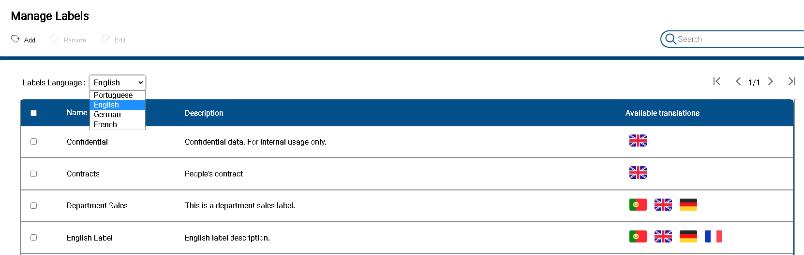
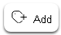
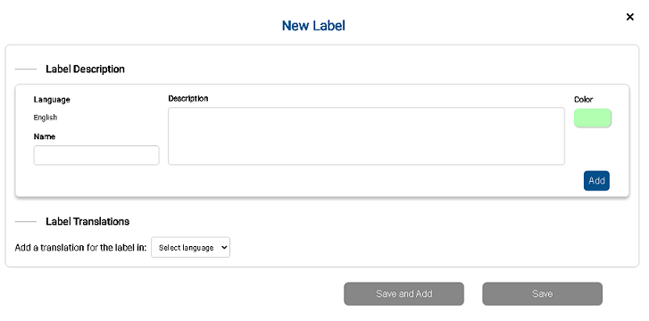
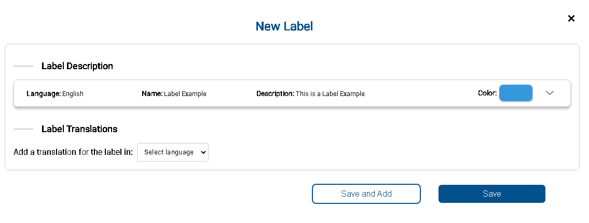
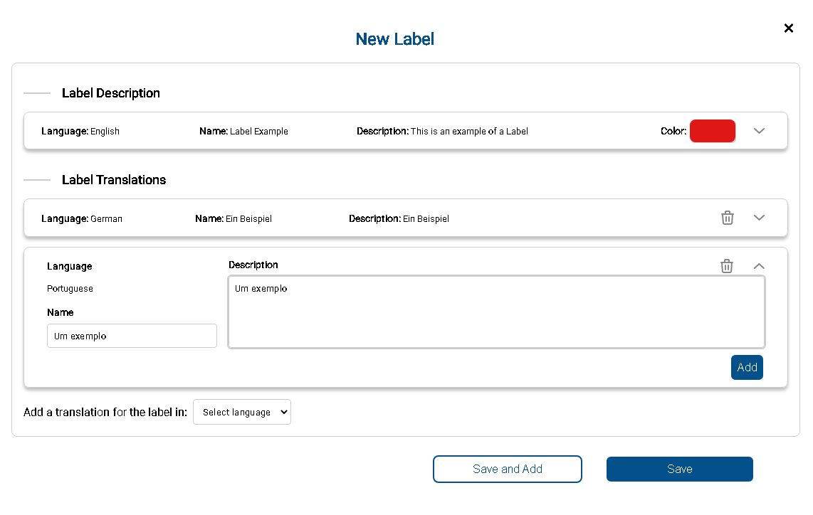
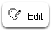
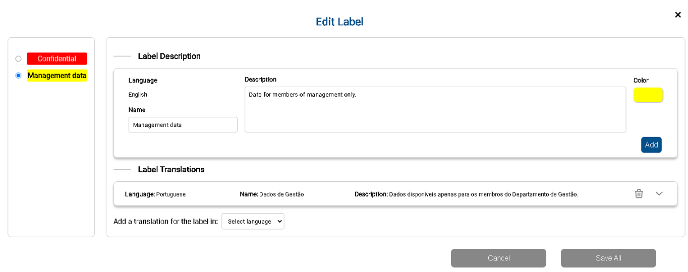
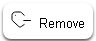
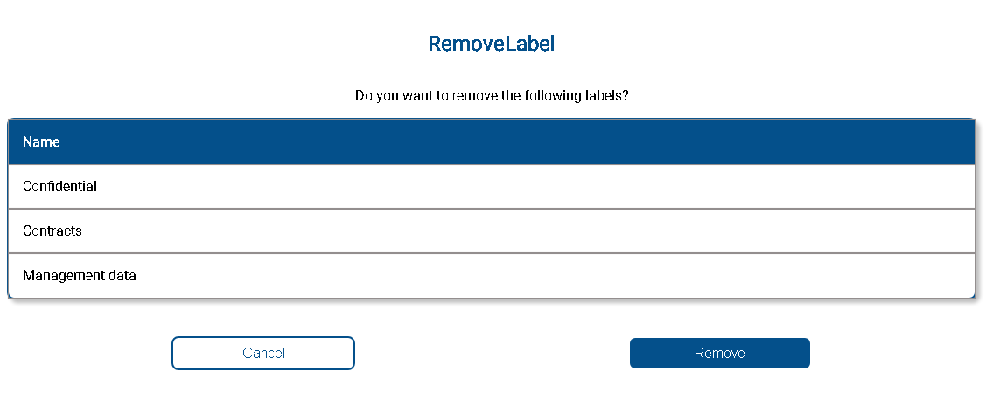
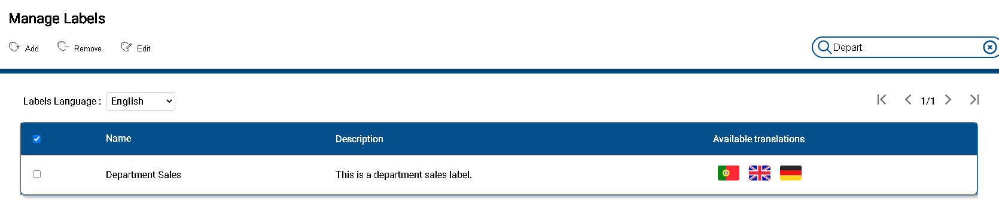

 

## Label Managment

 

Click the menu option  to access the Label Managment Main Window. As depicted in the image where you can find all funcionalities that allows  add, edit, remove a label, named label management actions. 
Located in the upper area of the window you will find button that triggers the label managment actions. Also a table with the labels showed in the select language. Each line at this table is a label where is indicated:

* Name - Identification of the label. Character string, containing a space that uniquely identifies a label. It is advisable to use one word or maximum two.
* Description - Short description that can be used to understand the meaning of the label.  
* Translations - Country flag icon that shows which translations are defined for the EZ2Cloud supported languages (French, German, Portuguese or English).

 

The translations are not done automatically but they must be actually defined. So, Labels with no translation defined to a specific language will be displayed in the Tenant default language. To view all the labels in a different language just click and select the language from the select box.

## **Add Label** 

To add a new Label, start by click in the button  and it will be displayed the modal Window New Label. Labels can be added one at a time by filling in the fields depicted in the following image. 
 The window has two sections:

1. *Label Description* - As the name implies this section it is where you descbribe the Label. And this is done by fill the name, a short description or the meaning of the label amd the color to be associated with. It is mandatory to fill all fields in this section to create a label. The language that will be used to it is showed with Language caption. After filling the fields you can just click the button Save and your label will be add with. Although no translation is added, the label it is defined in the language the label was created. 
2. *Label Translation* - Allows to add multiple translations to EZ2Cloud supported languages: Portuguese, French, English, and German. The translation can be set when creating a new label. To do so after fill the label description click the button Add. Then the New Label Window will change as the following image shows.   Click the select the language to be set the translation, for example German. And then the modal Window will be expandanded and it will be possible to fill in the translation, then click button Add. The same can be repetead for each language you want a translation. The result will be as depicted in the image. After add all the translations click button Save. Click Save and Add will add the new Label and allow to add more labels without having to close and reopen the modal Window.

## **Edit Label**  

Labels can be edited one at a time or by selecting multiple labels. You can either select only a label or multiple labels by select a row or multiple rows and then click the button   if you have selected multiple labels you will be able to access each one of them simply by clicking on the radio on the right side of the label name. In addition to being able to change the description of a label, you can also add new translations.

## **Remove Label**  

From the label table select rows that represents labels you want to remove, click button . You will see the following dialog  prompt to confirm the remove action. If you select multiple labels the confirmation dialog will be show all the labels selected.

  
## **Search Label** 

You can search over the list of labels. This search is done by the name and language that the user has selected. To do this, just write the text corresponding to the Label you are looking for, press enter and the table will show only the labels that match the search result, such as the example in the image below: 