 

## Projects

 

Click the menu option  to access the Manage Projects Window. As depicted in the image where you can find all funcionalities that allows to manage and access projects configuration settings and project file structure meta data.
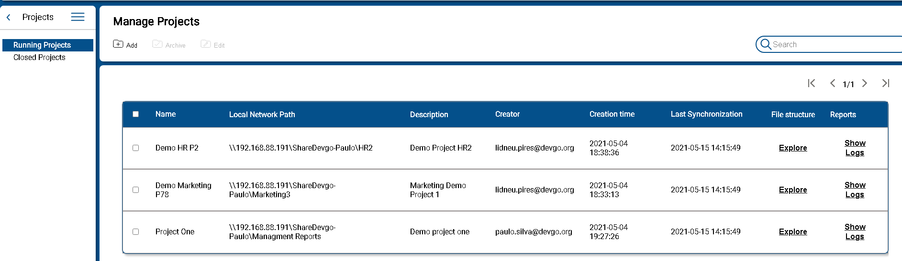
Located in the upper area of the window you will find button that triggers the label managment actions. Also a table with the labels showed in the select language. Each line at this table is a label where is indicated:

## Configure Projects

 

As shown above, projects are presented in two different groups. The running projects are in fact those that are being used as a work base. On the other hand projects whose work on them is finished are in Archived Projects. The configuration of a project is therefore done to define everything that is required to have a project that can be opened in File Explorer.

1. **Add Project**  
Click button 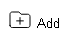 to create and set a new project. After that a modal window is displayed as depicted in the following image 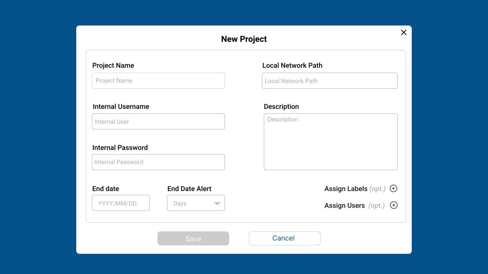

The data required to create a new project are:
      * Project Name - project identification that must be a unique string of alphabetic characters and possible numbers. 
      * Local Network Path - Path to the Shared Network folder in a on-premise server which the content is bouded with the project
      * Internal user - If need, defined a user to authenticate and gain access to the Shared network folder indicated in Local Network Path
      * Internal password -If need, the password for the previous indicated user 
      * Project description - A paragraph to describe the project. 
      * End date - estimated date for completion of work on the project
      * End date alert - indicates how many days before the end date the notification of the end of the project must be presented.
      * Sattelite Server - Which Sattelite Server will be used to connect to Ez2Cloud.

2. **Define Semantic Labels** 
 After filling the fields you can click Save button and the project will be created. Yet it will not be ready to be used in the Colaborative Work area because it is not full defined. To complete the definition it is required to Assign the Semantic and Ownership labels for the projects.

These are the tags available in the Collaborative working area and are set by click in plus sign after Assign Label or Assign Users. 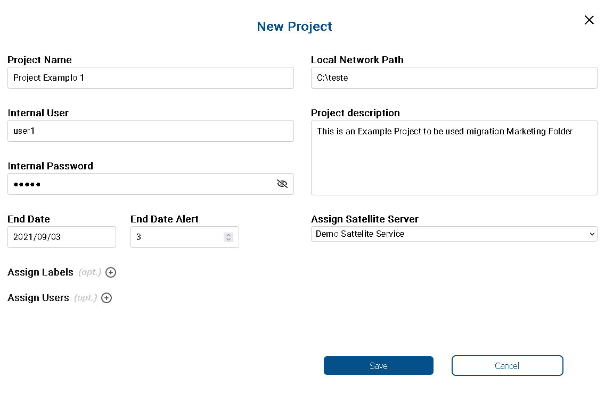The previous image depicted a project being created. In order to define the Semantic Labels click the plus sign icon after Assign Labels. The windown will be extended showing where to select the Semantic Label as depicted next. To assign a label just drag and drop from the label list on left to the defined label area. Colapse the window extended part by click the minus icon. 
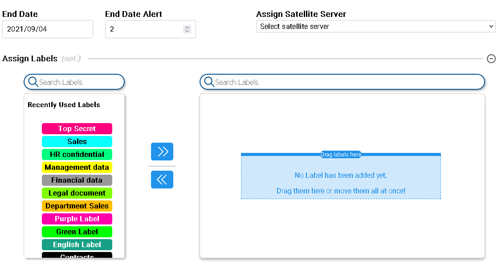

3. **Define Ownership Labels** 
In order to define the Ownership Labels:  
    + click the plus sign icon after Assign Users. 
    + The windown will be extended showing where to select the Ownership labels as depicted next. 
    + Drag and drop from the label list on left to the defined label area. 
    + Colapse the window extended part by click the minus icon. 
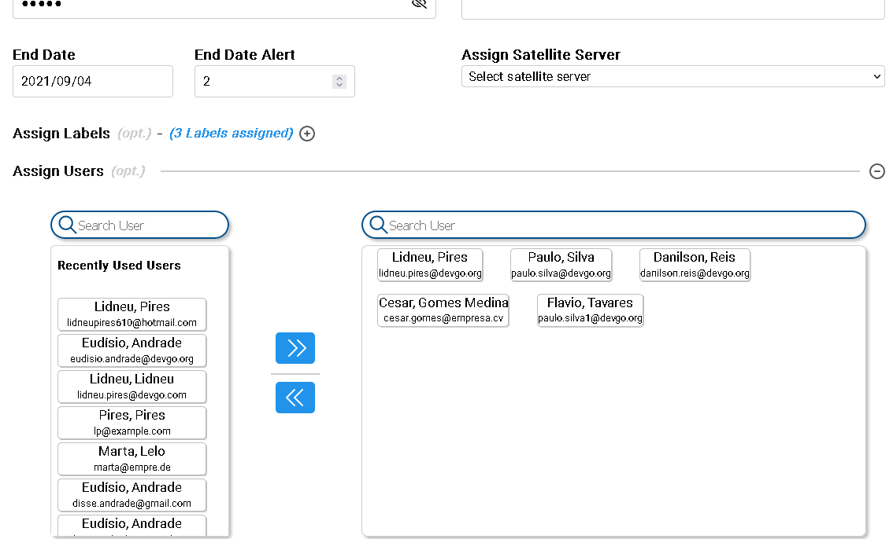

4. **Edit Project** 
Click button 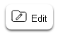 to edit an existing project. A modal window is displayed as depicted in the following image 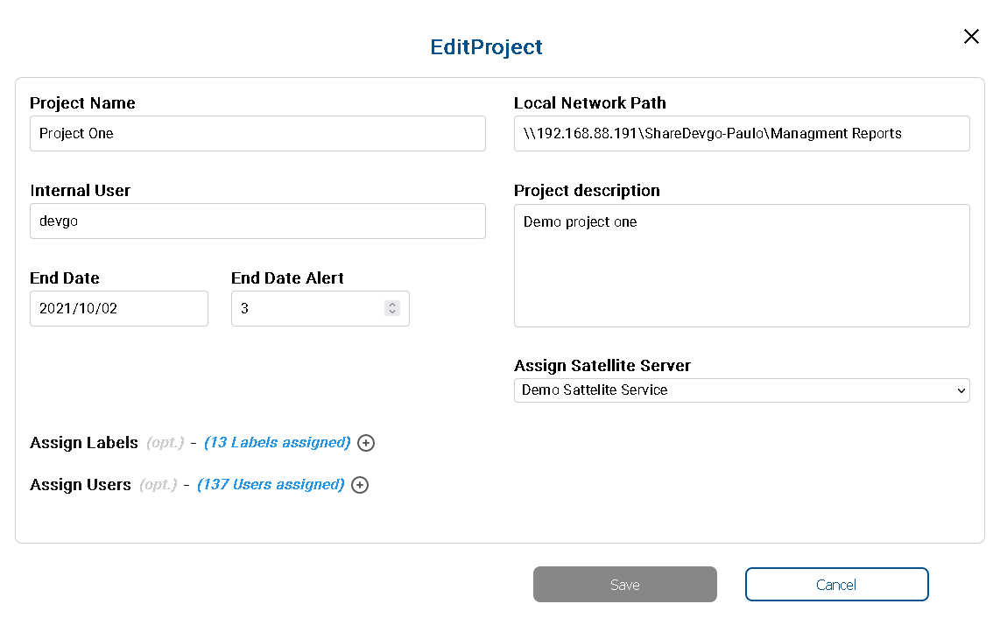. Here you can change the fiedls description, End date, End date Alert and Sattelite Server. It's not possible to change the fields Local Network Path if the Project has not yet a connection with a on-premise Sattelite Server active.   
  
5.  **Archive Project**  
From the project table select rows that represents the project you want to disable and then click button 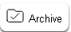. You will see the following dialog prompting to confirm where you must click the button Archive button to confirm. If you select multiple projects the confirmation dialog will be show  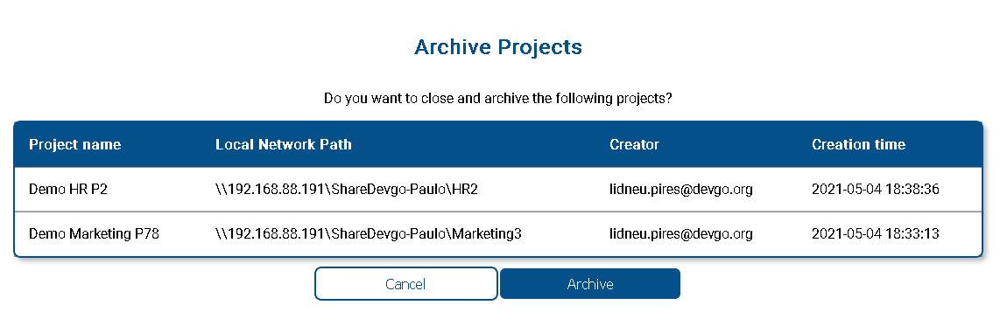

## Projects in Ez2Cloud

 

There is a set of data that result from the work carried out on the projects. In other words, the projects are being used in the collaborative workspace and there will be access to the project content or metadata of the shared folder linked to the project. Also for analysys and troubleshooting it is possible to access to the log data.

1. Project Content - At the project table, go to line corresponding to the project click  link  in the column File Structure. On click the link a new window will open displaying the EZ2Cloud Colaborative workspace with the project content as the example in the following image shows 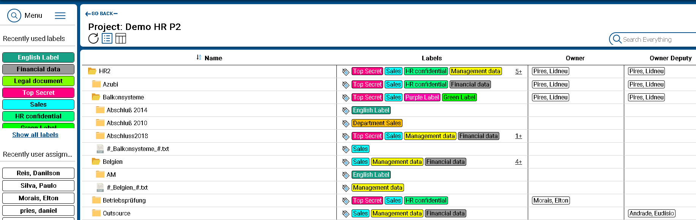
2. Reports - in the line corresponding to the project click  link in the column Reports.

