 

## Users 

User managment it is one of the mandatory configuration that is required as one of the primary task to be completed. Users account and their information will have a double perspective in EZ2Cloud. Indeed, user account are used in the authentication process and also to implement the Ownership Label concept. 

All the functionalities needed to manage user will be available under the User Managment Menu View. After click in this option   from the Main window side menu, the User Management View will be shown as the following image:

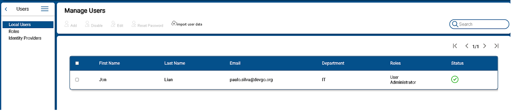

At the top of the User Management View there are multiple button that allows manage users: add, edit, disable, search users. Next you'll find more details on each of the available action. Note that these users are the ones managed by EZ2Cloud. In later version you can use users managed by Third part servies such On-premise AD ou Azure AD. 

## Local User Managment

 

The following section describe action to be performed on a single on a limited group of users. It is best suited to small group of users. 

All the local users accounts information are presented in a table as shown in the follwing image: 
The user account information that is presented can be ordered by the fields: First Name, Last Name, Email. Just pass the mouse over the title corresponding to the field you want to sort and click on the button 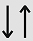 to sort the account information in alphabetically ascending or descending order. 
Also the information can be filtered by Departament, Role and Stauts. Do so by pass mouse over the title corresponding to the field you want to filter and click on the button  then choose the values you want to filter by.
Additionaly you can navigate to different pages by click in one this arrows 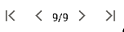 to move forward or backward. 

### User Status 

 

The local users have a status that refers to the current state of the user regarding EZ2Cloud Plataform. The different status are: 

*  - After register user account an invitation email was sent and it waiting further user actions.  
*  - Account has been created and it is currently in use. After the user accepts the invitation and actually set up the account.
*  - A user was disabled.

## Action on users

 

 The actions to be performed on the information user account will always started by selecting one or multiple users from the table. Selecting a user by just click the check-box at the row of the corresponding user or just click on multiple check-box or select all the users by click the check-box on the table header. 

 The buttons will be disabled until one or more users is selected. Also the Add User button can be disable due to the fact that the Tenant has reach the maximum number of users the current subscripiton allows. In this case upon the Add icon you will see the  icon 

1. **To Add User** 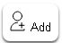 
Local users can be added one at a time by fill the fields showed in the following image. 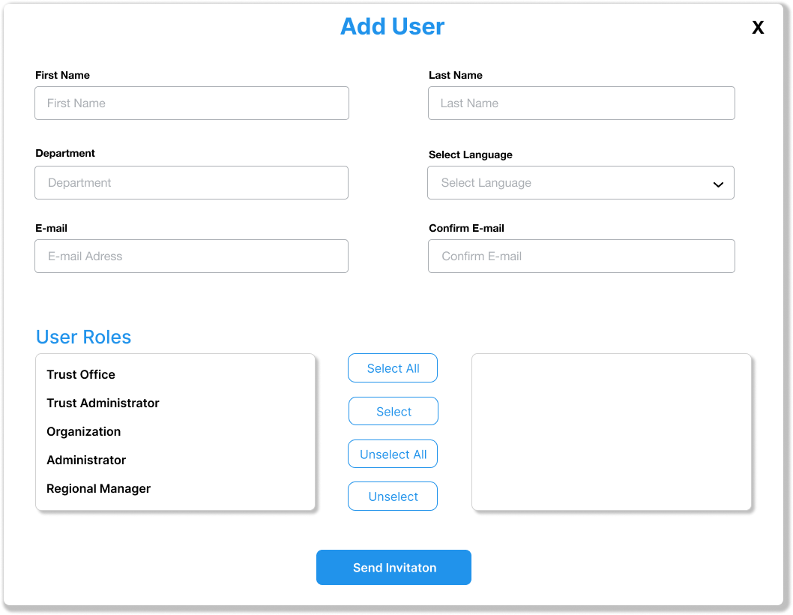

An invititation will be sent to the provided email address. In order to login the user must proceed to EZ2Cloud follow the invitation link embeded in the message and set his password and other provied other information that will be requested.

2. **To Edit User**  
Local users can be Edit to change a User account. A user with the Role Administrator can change the values of the Users account, filling values in the fields as show in the form on the image 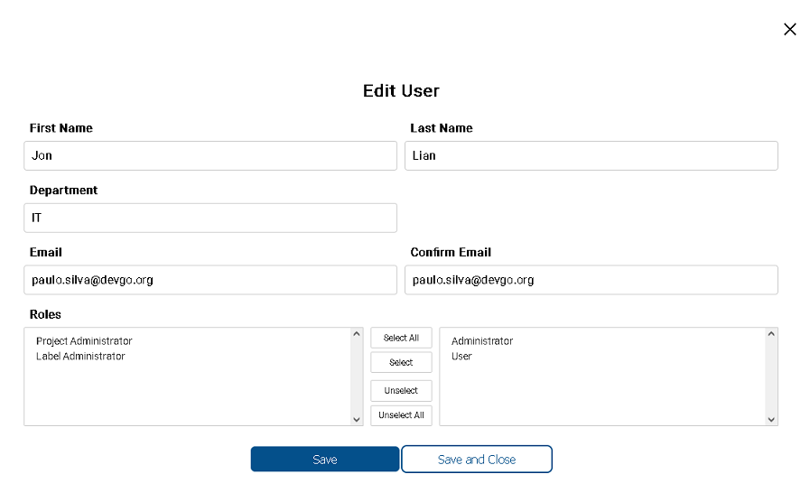. It is not possible to change email address. 

3. **To Disable User**  
From the user table select rows that represents the ones you wnat to disable and then click button . You will see the following dialog 
 where you must confirm to disable user. If you select multiple users the confirmation dialog will be show all the users selected 

4. **To Reset Password**  
From the user table select rows that represents the ones you wnat to reset password and then click button . You will see the following dialog 
  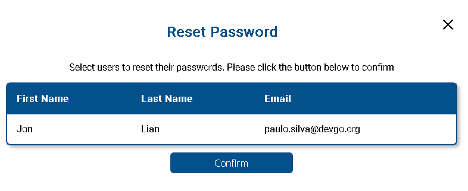 where you must confirm the reset user operation. If you select multiple users the confirmation dialog will be show all the users selected 
     

  
## Import Users

 

This is functionality to create users as a bulk process. Instead of creating users one each time the users are imported from a CSV file. The process only requires that you have a CSV file with all the data needed. For each user you want to create a line with the fields firstName, lastName, email and department separted by comma. 

To start import user click on the button 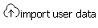. You will see the initial modal dialog Import user data, as the follwing image
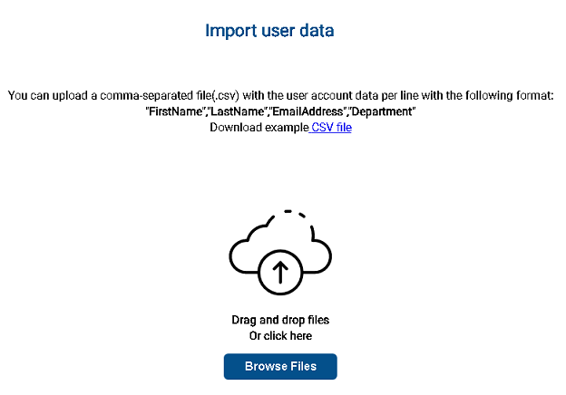

First you need to select the file containing the users data. Click Browse Files button. Then, from the File Chooser, select your account user data CSV file. Or just Drag and Drop  the CSV File in 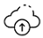 area. 

After select the CSV file you will be next pass to the next step with the modal window showing the name of file that was select and a button Next. Click the button Next the next step it is select the roles for the users. The window used for set the users rles has two list. At the rigth side the roles selected or the roles that all the users will have. At the left side the list of all existing Tenant roles. You can select or deselect a role by click on the arrows. After select the roles and click Next you will view a summary of all the users that was read from file as show in the following image. 

To confirm the user data and create the users just click on Sent Invitation button. 
 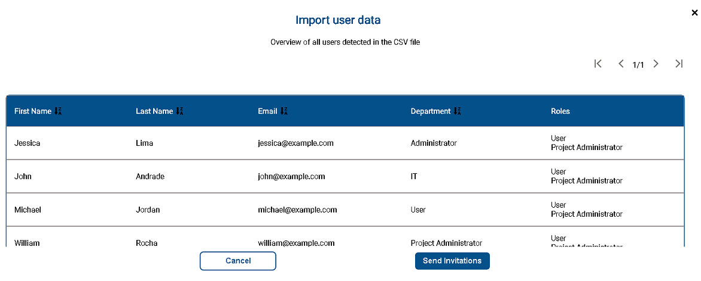

### More about Import Users Process

1. Multiple file to import - It is possible to import as much users from file you want in the same file or separated by different files. 
2. Role user - At the step of select Roles of the import users process the selected roles will be applied to all users on the file.
3. Invitation - An email is send to the email address of each user on the file, the created account has Pending status. The Users will stay in Pending status until the account is actually confirmed. 
4. Users limit - The limit of users is defined by the Tenant plan. 

## Users Roles

 
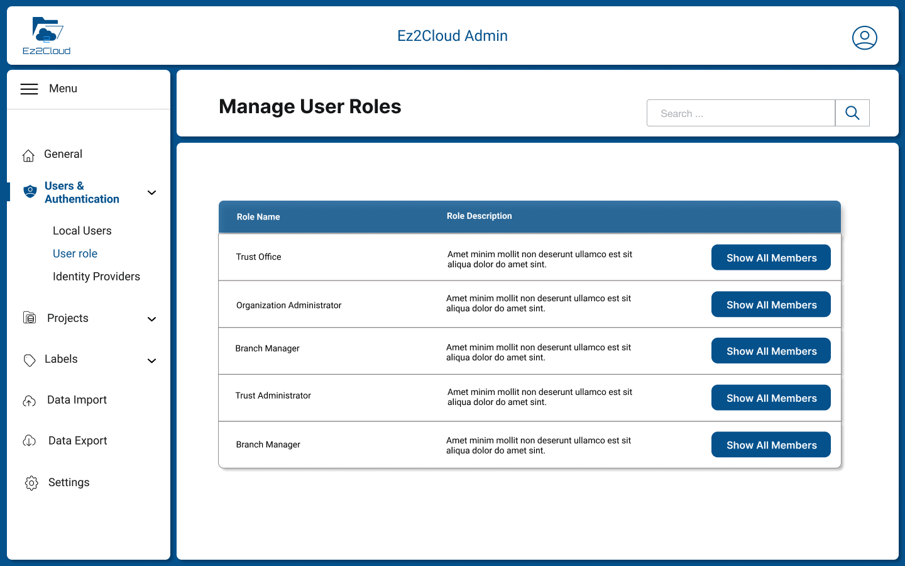

User role define what each user is allowed to perform in EZ2Cloud. From the role of Administrator to User there are different predefined roles. It is up to the Administrator to assign one or more roles to each user. Let's look at the roles in a little more detail:

1. **Administrator** - Users with this role has access to all features and functionalities. Can configure all the data required for a Tenant. Can change settings that impact all the Tenant users. Recommended for people who, in the context of a EZ2Cloud need full access to configure and setup the Tenant artifacts including sensitive and destructive actions like managing security or deleting data. 
2. **Project Admnistrator** - Users with this role can manage project. Create, Change settings, Archive, Setup and install Sattelite Service. 
3. **Label Administrator** - Users with this role will be responsible to manage the Labels. As the ownership labels are created from the user name the major concern of the users with this role is to actual manage the semantic labels. 
4. **User** - Users will be able to work at the colaborative working area from the End-user view.

 

These are the predefined roles the ones that can be used to assign one or more roles to each user. However, this is a task that can only be performed by a user with the role of Administrator. Normally the give user one or more roles it is done when the user is being created. But it is possible at any time change the users in a specific role.
 

From the role management window, (see image above) - click on the button
 in the row corresponding the role you want to change. For example if clicked in the row for Project Administrator role you will see all the users as show in the image 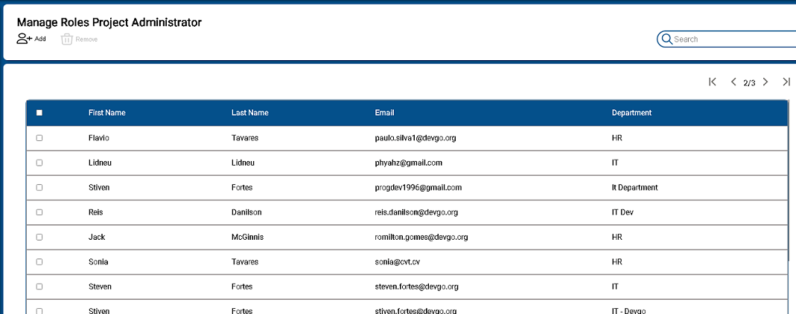 that currently has this role. Here you can Add more users to this roles or Remove the ones you don't want to have this role anymore.
 

There are no limits but  of course the role with access to functionalities that can affect all the Tenant users must be managed with care.

## Add user(s) to Role

 

To add users to a Role you must be in that Role View as was explain in the Users Roles section. So when viewing the Role and all the users as shown in the image 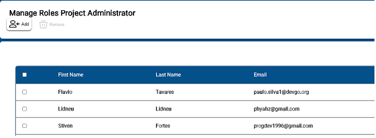 click the Button Add above the user information table.  After you must select, from the presented list of available users,  to add one or more users to the selected role.

## Dissassign user(s) from Role

 

At any time is is possible to Dissassign user(s) from a Role. To do this first you need to select the user of group of users you want to dissasign  as shown in the image 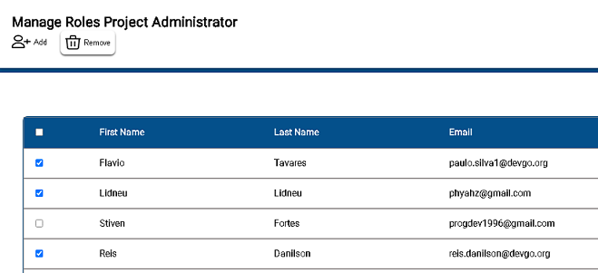 click the Button Remove above the user information table. Next you will be prompted to confirm the procedure and remove the users from the role. So on the question Dissassignuser(s) from selected role? click the button Remove. If you click the button Cancel you will head back the Role View. 

Of course, you must have at least one user with the Role Administrator.

## Externally authenticated users

 

No yet implemented

