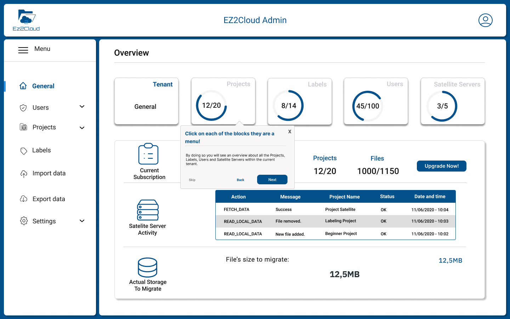
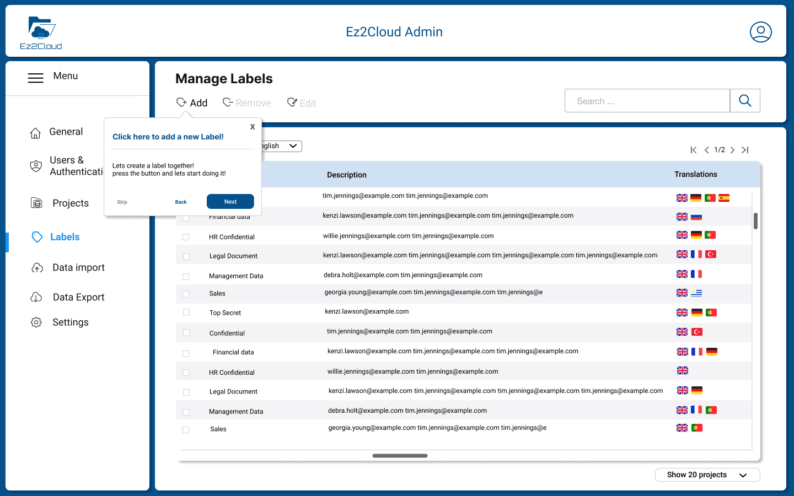
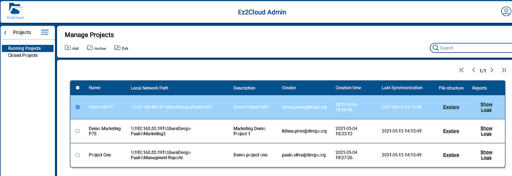

 

## Admin Guide: Reference for Administrators

 

Welcome to EZ2Cloud Admin Guide. Here you will find specific information on configuring EZ2Cloud and set all that is required to get your users onboard.

Find here more details about [Entities and Concepts](../Essentials/Concepts/index.md)

## Overview 

 

EZ2Cloud provides a Collaborative work approach to allow users from a company business unit to enhance information on a shared network folder content. The enhanced information is representing as semantic label or ownership label. So EZ2Cloud will work with the metadata gathered from a File Server and upon that users can add Semantic Labels and Ownership Labels accordingly the real usage of the File Server at a given time. 
This approach will work with Projects, Labels, Users, Satellite Service and other components that a user with an Administrator Role must first setting and configuring for company. 

## EZ2Cloud Dashboard

 

Here any user with the Administrator Role have an overview of the main Tenant area in EZ2Cloud. Namely information about Tenant identification, Projects that has been created and information about users, labels, Sattelite server and their status. Also it will be shown the current data related with which plan the Tenant has. If the Tenant has a non free plan, it is also shown information about the payment.

## Initial Configurations
There are a set of configuration required to be done in order to allow users to access and start work on EZ2Cloud after a Tenant is created. To see more details on how to create a Tenant please refer to [Create Tenant](../Concepts/../Essentials/Concepts/tenant.md)
If you have already created your Tenant then follow the steps that are described below.

The actual configuration will begin by creating and defining all information that will be used to represents EZ2Cloud users, users roles, labels, projects and other EZ2Cloud entities and concepts. So refer to the next link to specifics of each information item:

1. [**User Managment**](./ManageUsers.md)  
Find here all the detils related with User Managment functionalities. Create, Remove, Disable, Create multiple users from CSV files. Managing Users Roles and Configure and Setup Third-party Authentication. Theese are a summary of the main features and in order to have your users ready to use EZ2Cloud.  
   

1. [**Satelite Servers**](sattelite.md)
Following the initial Tenant configuration process, it is necessary to create the data elements for later use and installation of a Sattelite Server. 

1. [**Labels**](ManageLabels.md)
EZ2Cloud users will be using Semantic Labels or just Labels to tag folder and files. These Semantic Labels are defined in the specific context of an organization, department or bussiness unit as a requirment for each project when configure labels that can be used. The labels are related to a Tenant's organizational and work context so they must be created and configured optinally in multiple languages and refering to  terms that represent Tenant's business entities, concepts, and data.  

4. [**Projects**](./ManageProjects.md)
The main unit of information is a project. The concept of project as it is used in the context of EZ2Cloud brings together several elements that will serve as a basis for the collaborative work environment. Find here how to manage projects and bring them to the state ready to be used in EZ2Cloud.  

## Settings & Custumizing

 

 Ec2Cloud can be fully customized to reflect the corporate image of the Tenant's company or organization. There is then the possibility of defining a set of settings for this purpose. By default the software uses the settings defined by Devgo but you can change and adapt it as you wish.Also you change settings that are related with other Tenant information as language, Timezone. After click the Settings main menu option you will see the Settings sub-menu as depicted in the image.

Click one of the following links to find more on how to change settings and apply your own costumization that will be used by all the Tenant users.

1. [**Theme Custumization**](./Corporate.md) 
2. [**General Settings**](./GeneralSettings.md)

## Authentication

 

## Subscription Plans

 

EZ2Cloud has differents plans that will differentiate the workload that a tenant can support. To start using the platform, you can do it for free, but for better performance, you can upgrade your plan to a professional or business plan. Here you will have all the information regarding plans, payments and how to manage the subscription of a plan as well as details regarding payment methods that EZ2Cloud supports.

[Click here](./plans.md) to more details about EZ2Cloud plans.

## Troubleshooting

 

