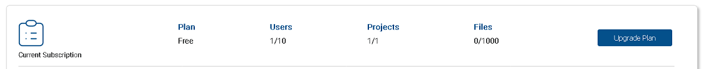
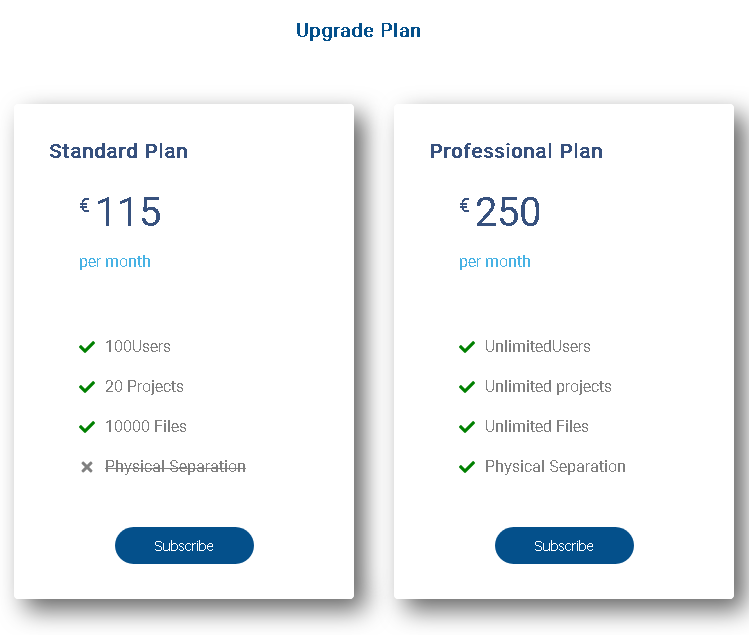
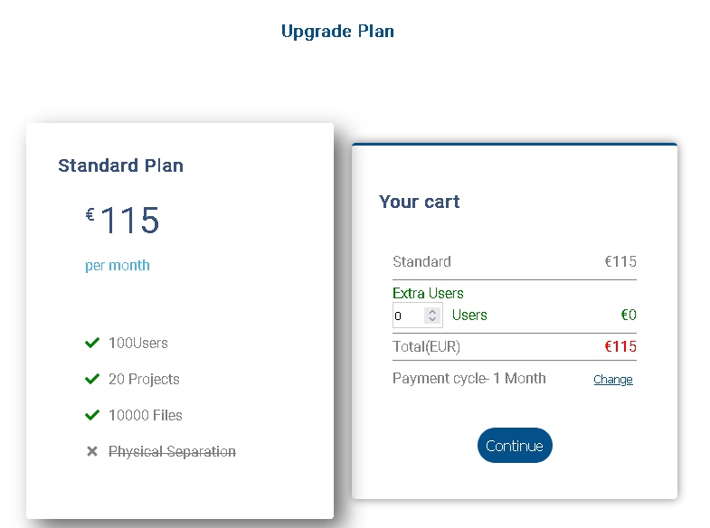
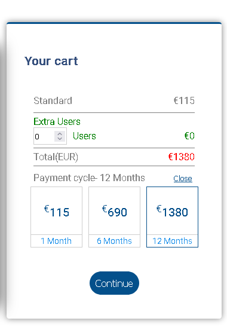

 

## EZ2Cloud Plans

 

In the Dashboard of the Admin window one can see the current plan a Tenant has. As depicted in the image it is presented which plan is active and summary of the restrictions that apply. If the Tenant has free plan also it is display the Upgrade Plan button. By click the the button you will start the purchase a Tenant Plan. 

. Currently there are two standard plans available as shown in the image. The information presented it is showed accordingly our standard plan and it has the differents limites a plan will have in terms of users, projeects, and files. Also it is part of the plan definition if a Tenant has a separeted database.

## Subscriptions  

Plans can be subscribed according to the Tenant needs. Click the button  of the respective plan you want to subscribe. A modal window will be displayed showing the plan information. Click continue to proceed to checkout and chooose your payment method in order to get te plan. 

At the same window it is possible to costumize some plan features as the quantity of users that one want to add to the default user number and the payment cycle. For example if needed, a Tenant can add more users to the Standard Plan or choose payment cycle of one year or six months, before proceed to checkout.

