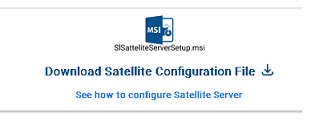

 

## Sattelite Server Overview

 

EzCloud works with meta data collected from network folders on an on-premise server. The identification, collection, organization, and sending of data from the server to EZ2Cloud is performed with a component of EZ2Cloud whose name is Sattelite Server. This is an application that will be installed and run as a local Service and through specific configurations it is authorized to obtain the metadata and request its processing and registration with EZ2Cloud.

When referring to Sattelite Server we will be talking about the need to configure a Sattelite Server in Tenant. And then the actual installation of the application on a server. The reference that will be created is used in the application as part of the authorization process and will be used in the definition of a Project.

 

When referring to Sattelite Server we will be talking about two different but also related steps: 

1. **Manage Sattelite Server** - Include task that refers to manage all the required data needed for the proper installition and operation of the application Sattelite Server
2. **Install a Sattelite Server** - Steps that refers to installation of the application on a on-premise server. 

## Manage Satellite Servers

 

Managing Sattelite Server data consists of defining the data elements that are required to use Sattelite Server in the context of EZ2Cloud. To access Satellite Server Management functionality from the Admin Menu, go to Settings. You will immediately see the window where you can perform the various actions available like Add New, Remove, Enable and Disable satellite server.

 

An example of the main view is shown in the following images.
 

1. **Action Area** - The top of window contains button used to trigger the actions Add New, Remove, Enable and Disable satellite server. 
2. **Sattelite Server Data** - At the middle a table with the data that define Sattelite Server and information generated on their activity.  Here you will see:
   
      * Name - Identifier and consists of a string of alphabetic characters that may contain spaces and additionally digits.
      * Connection Key - A character string used in the application installation and configuration process.
      * Internal Name - Fully Qualified Domain Name of the on-premise server running the Sattelite Server application
      * IP Address - Server running the Sattelite Server application IP Address
      * Last Connection - Date of the last connection to EZ2Cloud API from the application
      * Status - After the last connection what is the current status of the application. Possible values will be: Enabled, Disabled, Error.  
      * Reports - Each Tenant Sattelite Server application send logs. This can be view by click Show Logs link in the Reprts column.
  
3. **Download Area** -  At the bottom the Download area with a link to download the last stable version of the Sattelite Server application used in the setup process in a on-premise server 

&nbsp;&nbsp;&nbsp;&nbsp;&nbsp;&nbsp;&nbsp;&nbsp;&nbsp;&nbsp;

### Add New

 

To add a new Sattelite Server click the button  to open the mnodal window where must fill the fields required as shown next. Just follow the steps . 

1. Set Server Name - Fill in the Server Name field the name you want to identify your sattelite server. This is a unique identifier in the Teanant and consists of a string of alphabetic characters that may contain spaces and additionally digits. 
2. Genenrate Key - Click the button Generate Connection Key to generate the character string used in the application. 
3. Save - Click the button Save to save the data and go back to sattelite server summary view.

### Enable

 

Sattelite Servers in Disabled status can be Enabled at any time. To do this, first click and select the Sattelite Server table row or rows you want to enable. Just click the button  and at the Dialog prompting to confirmation click button Activate. 

### Disable

 

Sattelite Servers in Enabled status can be Disabled at any time. To do this, first click and select the Sattelite Server table row or rows you want to disabled. Just click the button  and at the Dialog prompting to confirmation click button Deactivate. 

### Remove 

 

Carreful with this action:Sattelite Servers can be permantly deleted. To do this, first click and select the Sattelite Server table row or rows you want to delete. Just click the button  and at the Dialog prompting to confirmation click button Remove. 

## Install Satellite Servers

 

Installing the Satellite Server application is straightforward. With the Setup you downloaded, you should start the installation following the standard procedures for installing an application for Windows Operating Systems. The application is called Ez2Cloud Sattelite Service and after installing it you should start it and you will see the initial window as the image shows. . 

To continue the configuration and start the application, copy a Connection Key from one of the Sattelite Servers you have configured in the EZ2Cloud Admin area fill in the Connection Key field and click the button Start.

 

If the connection key field has bot a valid value the application will notify you asking to enter a valid connection key.
 

if the validation of the connection key was successful then EZ2Cloud Sattelite Service will proceed with the execution of the tasks for which it was designed: connect through an API to EZ2Cloud, read the metadata of the network folder previously configured for a project, structure them and invoke specific end points to receive and process them.

 

After successfully executing the above tasks, you should see a confirmation window that everything has been properly configured as shown in the image

 

After closing the configuration window, EZ2Cloud Sattelite Service will start as a Windows Service named EZ2Cloud Sattelite. And the Service will be running with the main goal of after detect any changes on the file structure of a project folder executing the steps to update the metada on EZ2Cloud.
 

Hourly, the service analyzes the network folder structure defined in the projects the sattelite server is bounded checking for any change. If there is, the task of updating the metadata is launched, which is called EZ2Cloud Project Synchronization. All data that has already been referred as such Last Connection, Status, Reports and that is kept for each satellite server is always updated whenever there is synchronization.

