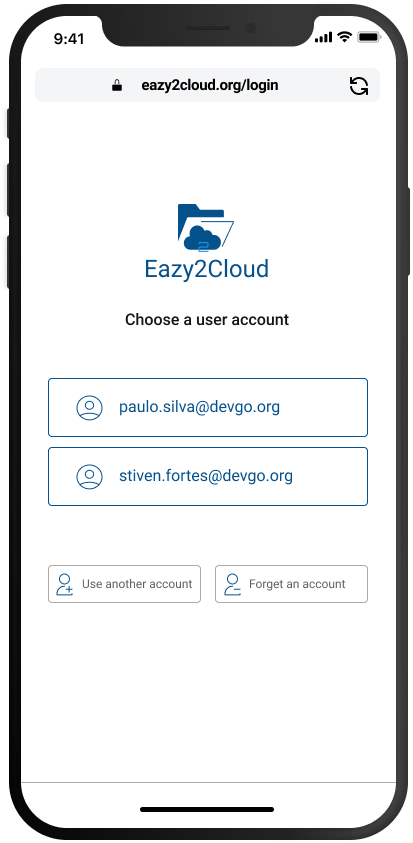
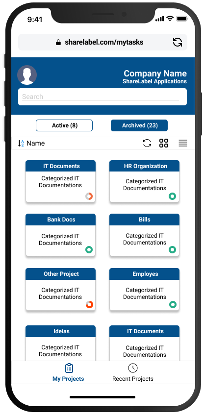
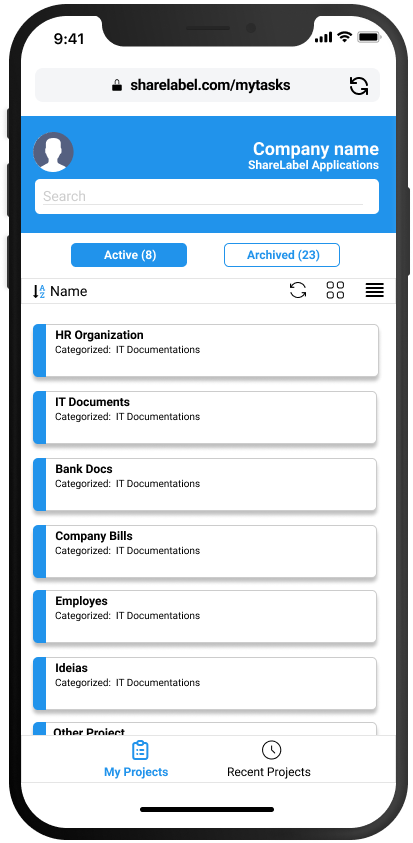
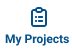
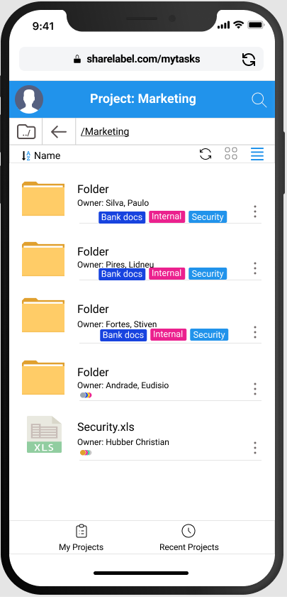
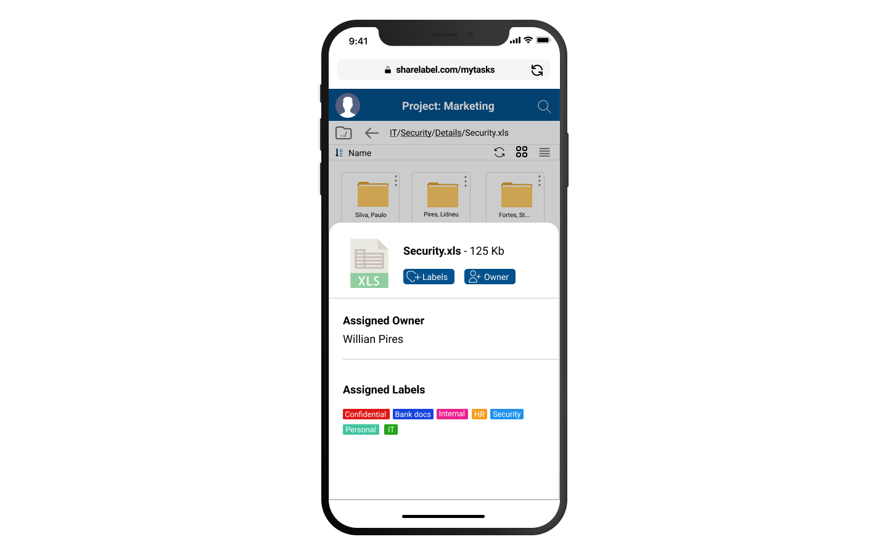

 

## Mobile Devices Features

 

Welcome to EZ2Cloud. We're glad to have you here. As a EZ2Cloud end-user you have access to all the features
your tenant subscription has access on a mobile device except EZ2Cloud administrator features. Some specific features and functionlities 
are not provided yet on mobile. 

For specific information on configuring EZ2Cloud see the Administrator documentation.

## Overview

 

The functionalities and features you will find on these pages are related with the main goal of EZ2Cloud: provides a colaborative and distribuited platform that allows you define and apply all the elements required on a migration job from on server to another or from an on-premise server to a cloud service.
 

To achieve this goal, EZ2Cloud relies in gathering data and produce information related with metada from files and folders located on a server network shared folder. Specifically the data that will be gatther from the users that actually works with the file servers contents in a distrubted and colaborative approach.

The metadata gather from server will be mapped to entities representing files and folders on EZ2Cloud, allowing each user to apply to files amd folders some labels. To sum up the platform will presents the users some file and let them assign labels, owners and with all the data gather and processed later on an authorized user can create and export a file with items that will be the source data for the migration.

## EZ2Cloud Mobile View

EZ2Cloud main window on mobile devices it is as the following image. So after login you will be redirects to 

User will view the list of all projects grouped by status. To switch from one group to another just click on the Active and Archived button. These buttons have a number indicating how many projects with either status the logged in user has access.

The main window will display the projects in two different views. To change to List view clicking button  and the same content will be displayed as a list like the image on the right shows .
Switch back to the default view by clicking button 
 
&nbsp;&nbsp;&nbsp;&nbsp;&nbsp;&nbsp;&nbsp;&nbsp;&nbsp;&nbsp;&nbsp;&nbsp;&nbsp;&nbsp;&nbsp;&nbsp;&nbsp;&nbsp;

The main window will display the projects as the first view. However you can always show the task again by clicking button 

## Working with Projects

The Colaborative Work supprted by EZ2Cloud to perform labelling on File and Folders projects will be available in the File Explorer. To open a project and display the File Explorer content, double click a project unit. The File Explorer will be displayed in default as the following image 

## Semantic Labeling

The Colaborative Work supprted by EZ2Cloud to perform labelling on File and Folders projects will be available in the File Explorer. To open a project and display the File Explorer content, double click a project unit. The File Explorer will be displayed in default as the following image 

## Ownership Labeling

The Colaborative Work supprted by EZ2Cloud to perform labelling on File and Folders projects will be available in the File Explorer. To open a project and display the File Explorer content, double click a project unit. The File Explorer will be displayed in default as the following image 

