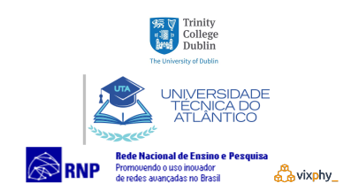

 

<h2>RENaaS Project Documentation</h2>

 

RENaaS, Research and Education Network as a Service for Developing Nations it is a project aims to design, implement, validate and showcase an architecture using an Emerging NREN off the west coast of Africa (Cape Verde).
 By using an institution where regular internet connectivity is already present, a pilot implementation will showcase eduroam and many other functionalities to the academic community of different institutions on Cape Verde island.

In a break from traditional approaches, the project will use virtualization network functions running on clouds - in different geographical locations - in a multi homing approach. Although one of the goals of the project is to deploy eduroam in Cape Verde, GÉANT’s RARE and RNP’s NosFVeraTO 
R&D main products will be deployed together to provide security and smart routing on cloud-based overlay networking - demonstrating how far a clean-slate NREN could go in reducing TCO. We believe that this approach has the potential of not only encouraging developing countries to deploy their NRENs, but also to produce a blueprint for consolidated NRENS - helping them to expand their reach and service catalogue in a cost-effective way. 

## Overview

 

The main goal of the project is to create, deploy and test a new framework for new NRENs which arise in developing countries. It will also provide a blueprint for existing NRENS to expand both connectivity and services to their member institutions while reducing the budget required to deliver these services. Our goal with a showcasing activity in Cape Verde is to build a community and to raise local awareness of other stakeholders in NRENs through the demonstration of cloud-centered services.

Community-building and stakeholder awareness for supporting the creation of sustainable NRENs in developing countries can benefit from cloud-based quick deployment of relevant services, such as eduroam, where regular connectivity is already present. Our innovation strategy involves aggregating proven solutions from past and current NREN R&D projects, such as RARE and eduroam itself, with private cloud-based NFV developed in NosFVeraTO from Brazil’s NREN RNP [4] . Development efforts will mainly focus on: i) security; ii) services; and iii) network control & management of such a system. Our future ambition is that our open networking cloud-based NREN solution could be considered as a viable architecture by consolidated NRENs, such as MoRENET in Mozambique, and also by federations of NRENs like the West And Central African Research and Education Network WACREN.

## List of Participants
&nbsp;&nbsp;&nbsp;

Participant No | Organization name    | Short name        | Country
------------ | ------------- | ------------- | -------------
1: Coordinator/Lead Partner | College of the Holy and Undivided Trinity of Queen Elizabeth near Dublin | TCD   | Ireland
2: Participant| Universidade Técnica do Atlântico | UTA | Cabo Verde
3: Participant| Rede Nacional de Ensino Pesquisa: PoP-ES @UFES | RNP/Vixphy | Brasil

## Project Innovation
The current NREN context and enabling technologies ecosystem are introduced in a “what if” approach to highlight untapped innovation opportunities we are try to exploit in this proposal: To maximize flexibility and to reduce depreciation of technology, we adopt the principle of “deploy in software where possible; deploy in hardware where necessary”. The main physical device that needs to be deployed is an edge platform that acts as an access point or conduit from the public and internal sides of the ReNaaS platform. 

1. [NREN Services](projectinov/index.md)
2. [Programmability of Network Equipment and Infrastructures ](projectinov/network.md)
3. [Access Networks](projectinov/access.md)

## Expected Impact 

As far as strategically positioning NRENs, the main impact is to lower the bar for new NRENs to arise in developing countries, as well as to provide a blueprint for existing NRENS to expand both connectivity and services to their member institutions with much reduced impact to their budget. Our goal with a showcasing activity in Cape Verde is to develop both community building and an approach for raising local awareness of other stakeholders in NRENs through the demonstration of cloud-centered services. Before testing in Cape Verde, the RENaaS solution will first be verified by TCD in Ireland. This will allow the RENaaS solution to be functional validated prior to trialing with real users in Cape Verde. 

