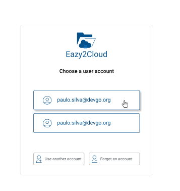
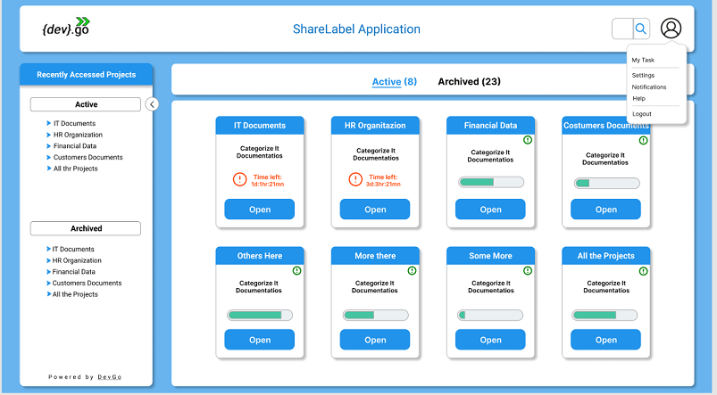

## Users first time login

 

Insert your email account that will be your identification as show on the previous image and press Next. 
 After if the process of validation it is ok you will provide your password as the image bellow shows.

 

If the device you are using already have been used for other users to access EZ2Cloud the login page will shown the stored identification of the users as following. In this case to login with your user just click on the button Use another account.

 

After authorization and autentication procedures completed depends on the result it will shows 

