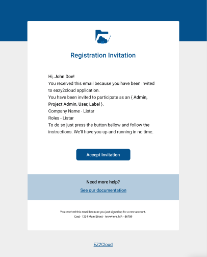

## New users

 

To login you must first have a valid user and a password. Also your user must already have a configuration on how the authentication will be processed.This must be previouwsly be done by a user with an Administrator role. So if you don't have a user name and the authentication options defined please contact your IT support team. 

The new users are configured and you will receive an e-mail message containing an EZ2Cloud invitation. In order to activate a new user you must follow the link and the instructions on the e-mail content. As showing on the image bellow, to procede to the account activation click on the button or link named Accept Invitation

