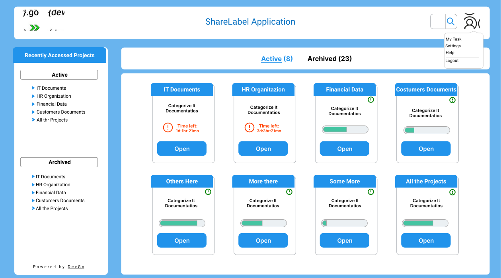

## Active Projects

After successful log in a user will view the main window on EZ2Cloud. This window will contain all the Active projects the users can work on. In others words the projects the users has been assign to. 

One can view the Active projects from any other location. Just click on the user icon at the top right corner and choose My Tasks. When a user is viewing active projects the Word Active is it highlighed and between parentisis the number of active projects. 

