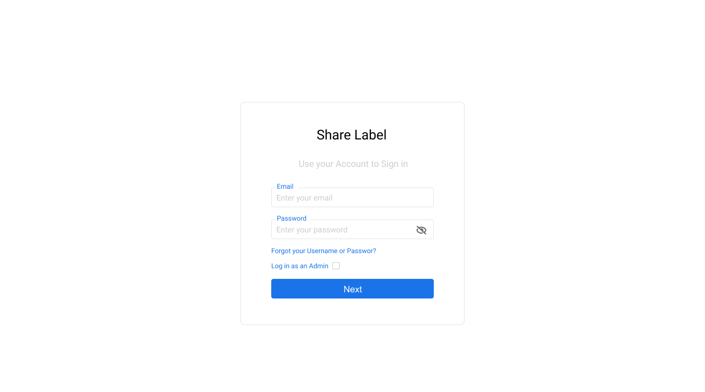

## Role based Features

In order to login you must first get a user invitation email from the IT Administrator for your company or departament. After receive this email you can set a new password 
and access to the application. 

To sign in go to the Login link and you will see the following window where you can enter your users credentials. 

## [Features to Specifics Roles]
1. [Project Administrator](intro.md)
     * [New User](newuser.md)
     * [First time log in](firsttimelogin.md)
2. [Label Administrator](../projects/intro.md)

