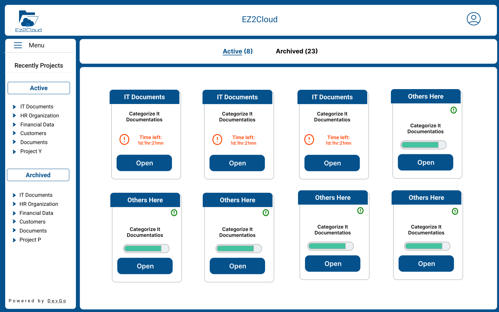

## View Projects

On successfull log in, a user access the view of the main EZ2Cloud window showing all active projects he/she is assigned to. The window has the main areas as showed in the follwing image. 

## Projects in End-user main window

The window presenting the projet information overview has three main area:
 
1. Content Area - Center rigth side of the main window will be shown the Projects artifact,named Project Unit, with brief information like name, description, a green bar showing the progress fo the work and a button to Open the project.
2. Projects Tab - The Links Active and Archived are two different sections for accessing Projects. Working in progress will be done on the projects with Active Status. It is possible to view projects already archived.
3. Side Menu - Menu that will listed projects and user can navigate to them by click on the link. 

## Project Unit information

Each project it is represented in Content area by a project unit as the image showing. In the addition to the visible information, at the top right corner, on mouse over, it is shown a ballon with the project expiration date.

To start working in a project, user  can click Open button. This will allow users to navigate to [File Explorer](./fileexplorer.md) and start collaborative work in a project. 