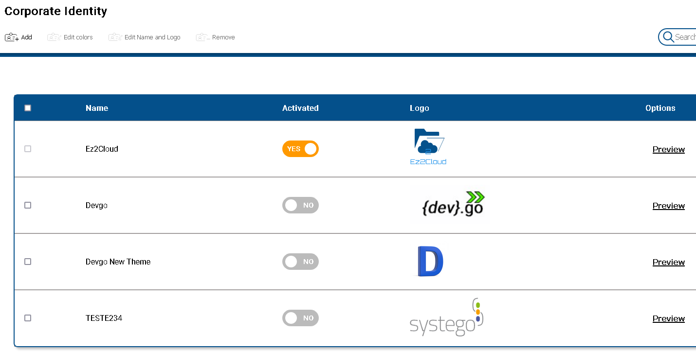
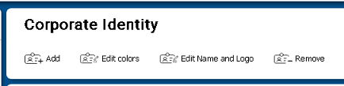
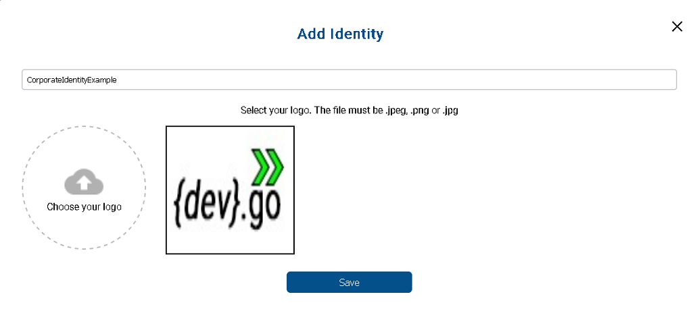
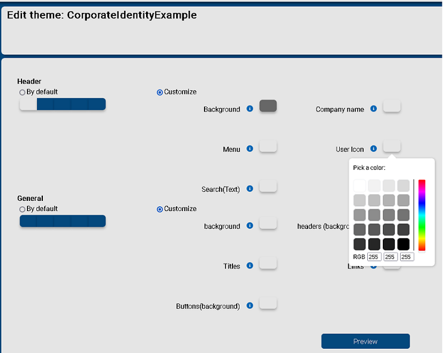
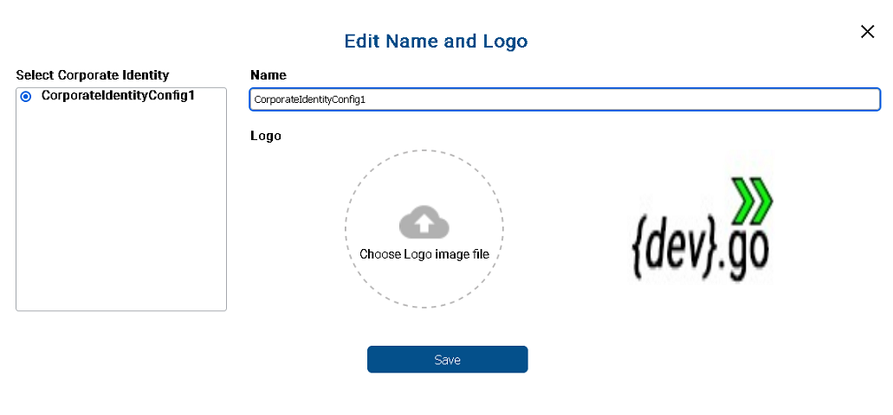
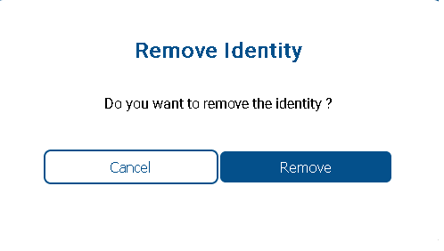

 

## Corporate Identity

 

EZ2Cloud can be customized according to the Tenant's corporate identity. Elements like logo and color of different areas of application windows can be changed if one not willing to use the default settings. 

Whenever you want to change the settings, you can change an existing configuration or you can create a new configuration where you will define all the elements.  The following image shows information from a settings summary table. So each configuration has a name or identifier, a status indicating which one is active, an image of the logo, and the colors to be applied.  The default configuration is named Ez2cloud and cannot be modified. In addition to this, there will be as many settings in the table as you want. 

## Custumization

 

 To add, modify or remove one of the settings, you will use one of the following buttons, which are found at the top of the window. By default the buttons for editing will be disabled and they are only enabled after selecting the configuration to be changed.

1. **Add Configuration**  
To add a new Configuration, click the Add button. A modal window where you will filled the required fields will be shown as in the image  Fill the name or identification for the configuration. Select and upload the file containing the image logo and click button Save.

2. **Edit colors**  
 To change the colors that are currently in a configuration, first select from the table the configuration by click the corresponding row table. Then click the button Edit colors. You will view the Edit Color window where you'll select with a Color picker which color to use in the presented section as depicted in the following image. . The main sections where you can select colors are grouped by two main categories: header and general. After, select the colors click the Preview button to have a preview how they will be applied to the windows application. if you really want to use the defined color setting click on the button. If not, just click the go back arrow to change the colors again. 

3. **Change Logo**  
To change the logo image that are currently in a configuration, first select from the table the configuration by click the corresponding row table.  Then click the button Edit Name and Logo. You will see the following dialog 
 where you can select and upload a new file containing the logo image you want to use and click Save button. 

4. **Remove Configuration**  
From the table select rows that represents the configuration you want to remove and click button Remove. You will see the following dialog confirm the remove configuration operation. 
  
