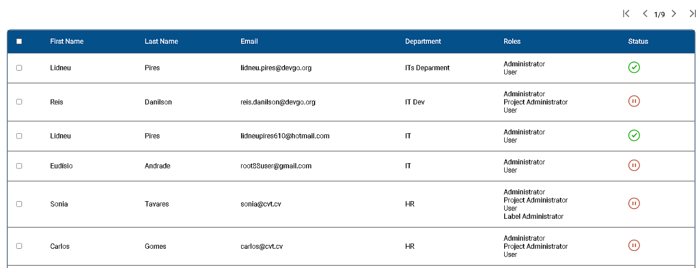
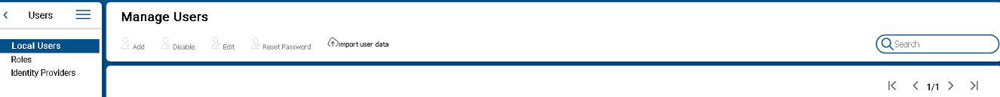
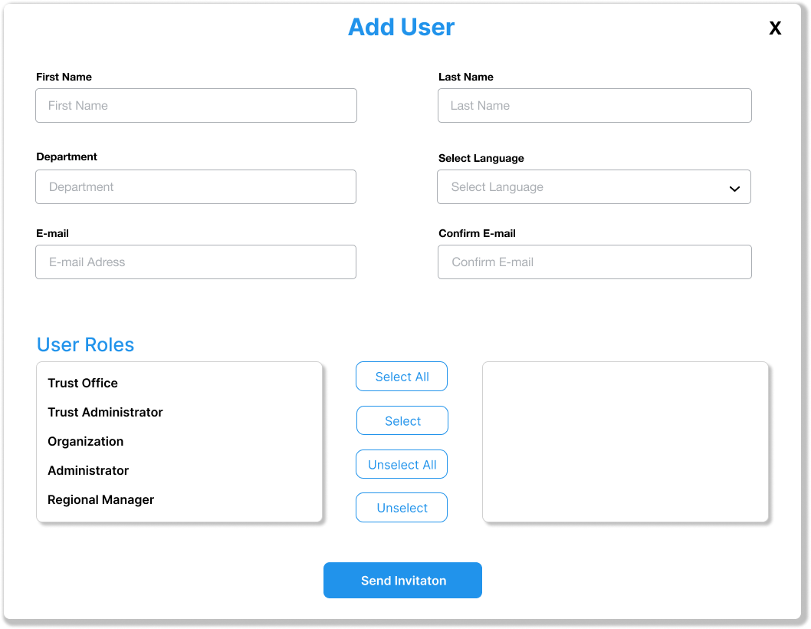
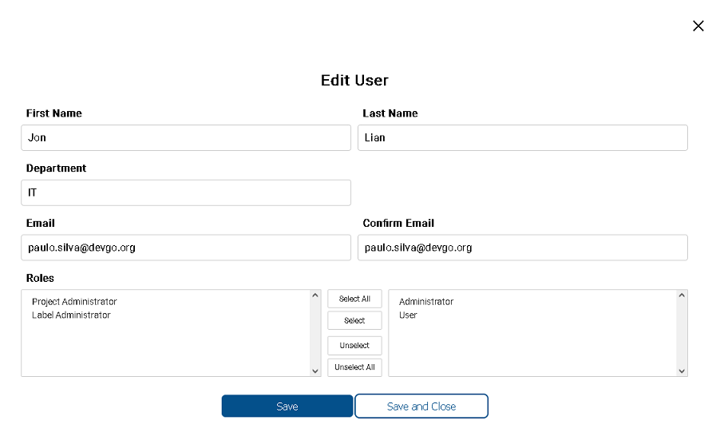
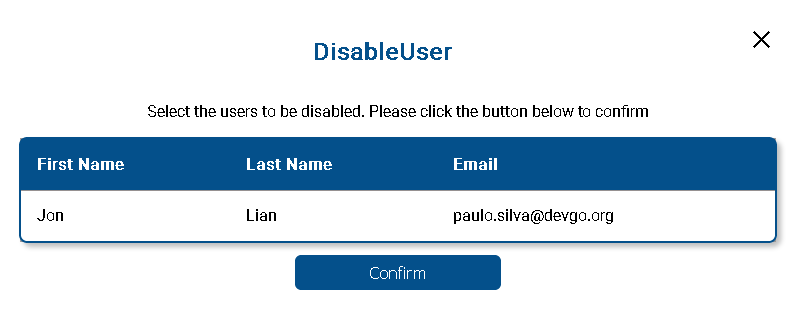
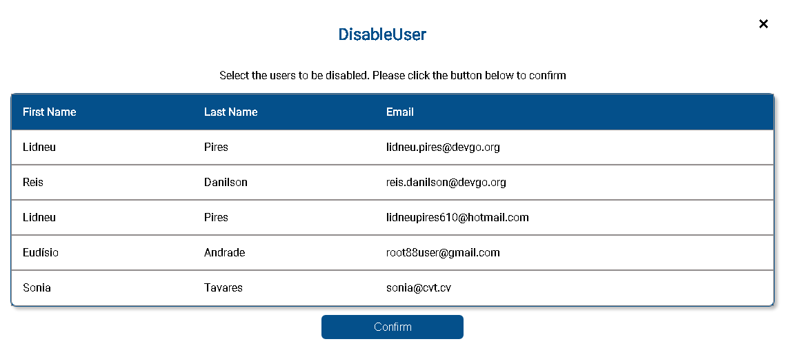
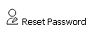
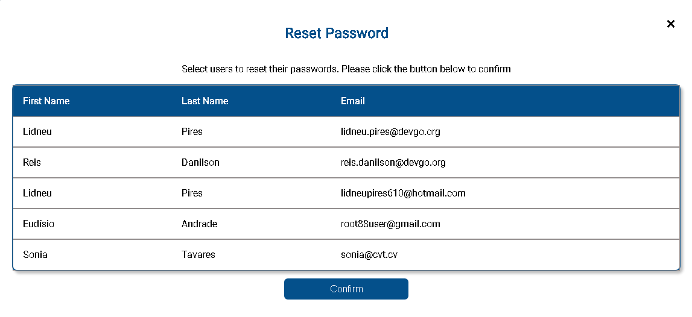

 

## Local User Managment

 

The following section describe action to be performed on a single on a limited group of users. It is best suited to small group of users. 

All the local users accounts information are presented in a table as shown in the follwing image . The information can be ordered by the fields: First Name, Last Name, email. And also the information showed in the table can be filtered by Departament, Role and Stauts by click in the name field at the Table Header. 
Also you can navigate to different pages by click in one this arrows 

## Action on users

1. **Add User** - 
Local users can be added one at a time by fill the fields showed in the following image . An email will be sent to the email address that was provided and after that a user can login.

2. **Edit User** - 
Local users can be Edit to change a User account. A user with the Role Administrator can change the values of the Users account, filling values in the fields as show in the form on the image . It is not possible to change email address. 

3. **Disable User** - 
From the user table select rows that represents the ones you wnat to disable and then click button . You will see the following dialog 
 where you must confirm to disable user. If you select multiple users the confirmation dialog will be show all the users selected 

4. **Reset Password** - 
From the user table select rows that represents the ones you wnat to reset password and then click button . You will see the following dialog 
   where you must confirm the reset user operation. If you select multiple users the confirmation dialog will be show all the users selected 
     

  
