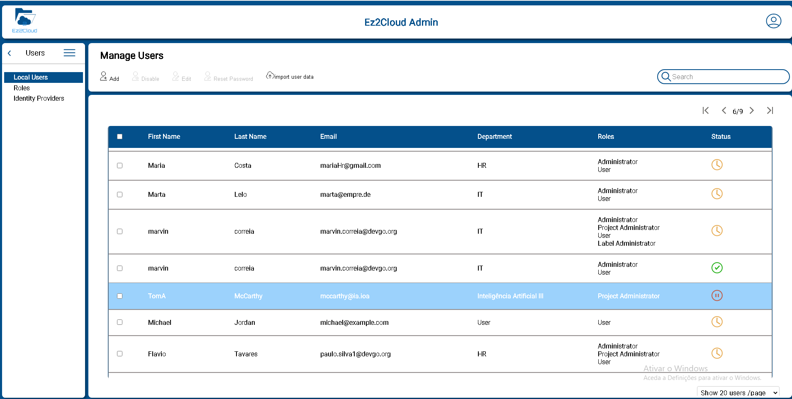
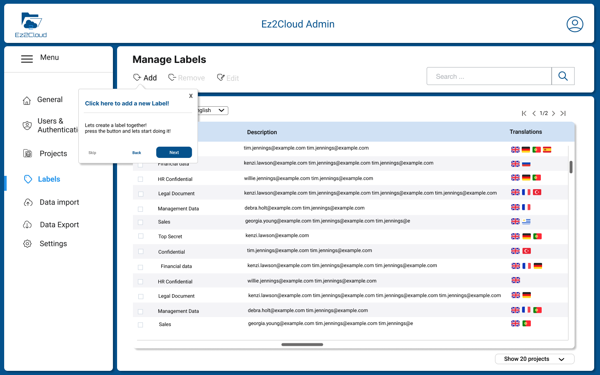
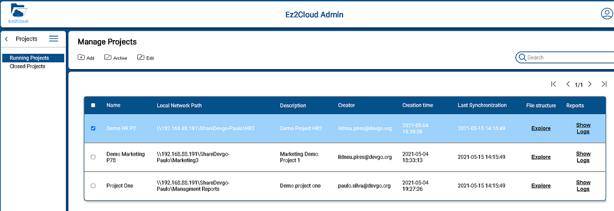

 

## Initial Configurations
Find here all the mandatory inial configuration that are required to be completed in order to allow users to access the EZ2Cloud and start work after a Tenant is created. To see more details on how to create a Tenant please refer to [Create Tenant](../../Concepts/../Essentials/Concepts/tenant.md)

The actual configuration will begin by creating and defining all information that will be used to represents EZ2Cloud users, users roles, labels, projects and other EZ2Cloud entities and concepts. So refer to the next link to specifics of each information item:

1. [**User Managment**](../ManageUsers.md)  
Find here all the detils related with User Managment functionalities. Create, Remove, Disable, Create multiple users from CSV files. Managing Users Roles and Configure and Setup Third-party Authentication. Theese are a summary of the main features and in order to have your users ready to use EZ2Cloud.  
   

1. [**Satelite Servers**](../sattelite.md)
Following the initial Tenant configuration process, it is necessary to create the data elements for later use and installation of a Sattelite Server. 

1. [**Labels**](../ManageLabels.md)
EZ2Cloud users will be using Semantic Labels or just Labels to tag folder and files. These Semantic Labels are defined in the specific context of an organization, department or bussiness unit as a requirment for each project when configure labels that can be used. The labels are related to a Tenant's organizational and work context so they must be created and configured optinally in multiple languages and refering to  terms that represent Tenant's business entities, concepts, and data.  

4. [**Projects**](../ManageProjects.md)
The main unit of information is a project. The concept of project as it is used in the context of EZ2Cloud brings together several elements that will serve as a basis for the collaborative work environment. Find here how to manage projects and bring them to the state ready to be used in EZ2Cloud.  

## Settings & Custumizing

 

 Ec2Cloud can be fully customized to reflect the corporate image of the Tenant's company or organization. There is then the possibility of defining a set of settings for this purpose. By default the software uses the settings defined by Devgo but you can change and adapt it as you wish.Also you change settings that are related with other Tenant information as language, Timezone. After click the Settings main menu option you will see the Settings sub-menu as depicted in the image.

Click one of the following links to find more on how to change settings and apply your own costumization that will be used by all the Tenant users.

1. [**Theme Custumization**](../Corporate.md) 
2. [**General Settings**](../GeneralSettings.md)

